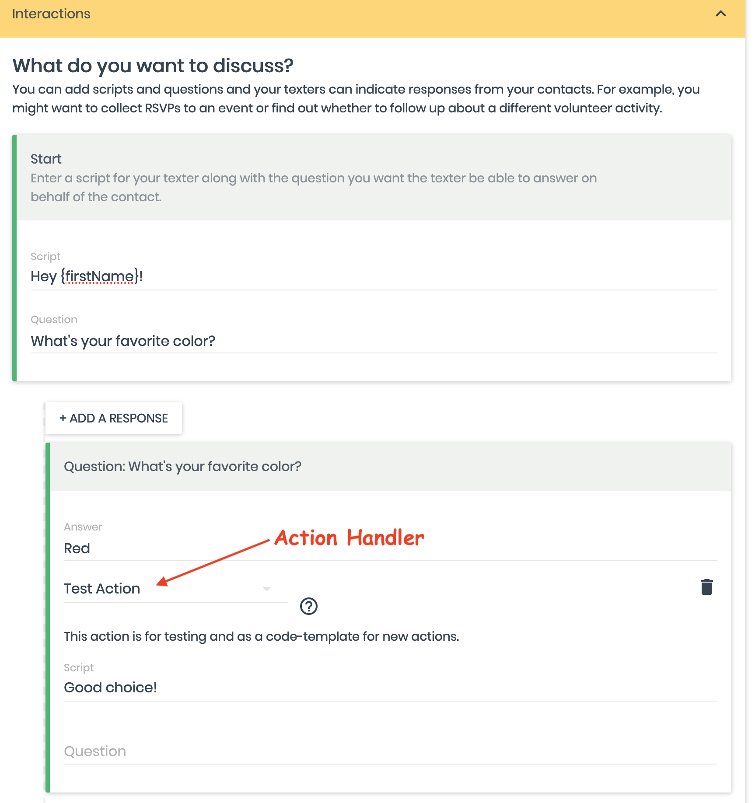
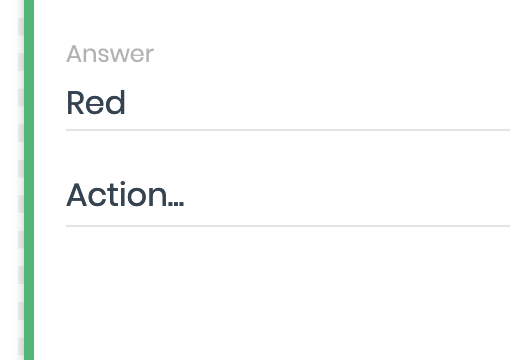
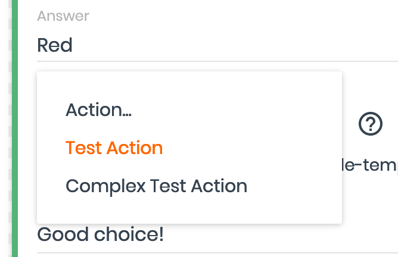

# Action Handlers Framework

Action handlers are a mechanism in Spoke that allow Spoke to take action when a texter indicates
that a contact signalled a certain answer to a question in a Spoke interaction script.

There's a framework in Spoke that allows the System Administrator to enable
action handlers, as well as to make it straightforward for developers to
implement them.

## Action handlers included with Spoke

Spoke includes several action handlers that integrate Spoke with some common
external systems:

- [ActionKit](docs/HOWTO_INTEGRATE_WITH_ACTIONKIT.md)
- [Mobile Commons](docs/HOWTO_INTEGRATE_WITH_MOBILE_COMMONS.md)
- NGPVAN and everyaction ***(coming soon)***
- [Revere](ocs/HOWTO_INTEGRATE_WITH_REVERE.md)

In addition, there are two action handlers that don't do much, but they serve
as reference implementations:

- [test-action](../src/integrations/action-handlers/test-action.js)
- [complex-text-action](../src/integrations/action-handlers/complex-test-action.js)

## Using action handlers in the script editor

#### When an answer as a linked action handler.



#### When no action handler is linked



#### Choose an action handler



## Enabling action handlers

Action handlers available to organizations in the system are managed by the
environment variable `ACTION_HANDLERS`. Unset, the default includes `test-action` and
`complex-test-action`. The value should be the list of enabled contact loaders
available to any organization using the Spoke installation. Separate the names of
action handlers with `,` (commas), without any spaces before or after the comma.
E.g., to enable ActionKit RSVPs and Mobile Commons signup: `actionkit-rsvp,mobilecommons-signup`
(The name listed in `ACTION_HANDLERS` must correspond to the name of a file
in `../src/integrations/action-handlers` with the `.js` extension removed.)

The system administrator can further restrict the action handlers available
to specific organizations sharing a Spoke instance by setting `ACTION_HANDLERS` in
the `features` column in the `organization` table.

Just enabling a contact loader is the first step, but action handlers often
have additional context required for them to be visible. Please refer to the [documentation
for the individual action handlers](#Action-handlers-included-with-Spoke).

The server admin can look at the action handler implementation file in `../src/integrations/action-handlers`
inside the function `serverAdministratorInstructions`
(this data might sometime be visible to superadmins on a documentation page)

## Developing Action Handlers

The best way to make a new action handler is something like this in the codebase:

```
cd src/integrations/contact-loaders
cp -rp test-action.js <NEW_CONTACT_LOADER_NAME>.js
```

Then edit the new file.

Action handlers implement common functions that are called and used in different parts of the application.

There are three main "points" where a contact loader can hook into the application.

1. When a campaigner loads the "Interactions" section of the "Edit Campaign" screen, the framework generates a list
   of all available action handlers, and if an action handler supplies client choice data, the framework
   provides that as well. The framework obtains availability and client choice data from the action handler
   implementation. An action handler can determine its availability and obtain its client choice data
   by validating the configuration or querying an external system, for example.
2. When a texter selects an answer linked to the action handler, the framework will invoke the action handler's
   `processAction` method.
3. For sophisticated applications, the action handler can add endpoints or otherwise change the
   express app on-load of the function. This can allow asynchoronous server-to-server APIs if necessary.
   This is how an action handler would expose webhooks to which external systems can make requests.

## Diagram

_Coming in a future iteration of this document._

### What to implement

The implementation of an action handler is encapsulated in a single file in the `../src/integrations/action-handlers` folder.
The name of the file (minus the `.js` extension) is what must appear in `ACTION_HANDLERS` to enable the action handler.

All action handlers ***must*** export the following:
- `displayName` -- what campaign administrators see to choose this action handler.
- `instructions` -- information system administrators need when they configure the action handler.
- `available` -- whether the action handler is avaiable in the context of an organization. Implementers can use this
  method to check handler-specific configuration.
- `processAction` -- called when a texter selects an answer that is linked to this action handler. This method can
  be used to send information in an external system, update the database, or enqueue a job.

These exports are documented in comments in the reference implementation
[test-action](../src/integrations/action-handlers/test-action.js).
(_Coming soon!_)

Action handlers that provide client-choice data  ***must*** export the following:
- `clientChoiceDataCacheKey` -- a key to use to store and retrieve client choice data in a cache, in order to
  minimize expensive calls to external systems.
- `getClientChoiceData` -- returns all the choices available for the action handler.

Action handlers ***may*** export the following:
- `addServerEndpoints` -- expose a webhook in order to support asynchronous transactions. For more information
  refer to the [Using addServerEndpoints](#Using-addServerEndpoints) below.

These exports are documented in comments in the reference implementation
[complex-text-action](../src/integrations/action-handlers/complex-test-action.jsr)
(_Coming soon!_)

### Using addServerEndpoints

There are a couple use-cases for addServerEndpoints where you add extra url paths
to the base Spoke application.  In all of these cases, it's important to be mindful of
security -- it's a powerful option, but also a dangerous one.

#### Some use cases

* Supporting asynchronous webhook apis (where e.g. processContactLoad sends a request for data and needs to set an endpoint where the other host sends the data back in)
* Start campaign links triggered from a different web site
* A side-channel for very interactive steps in the react component with an api.

Start your paths with either `/int*` (for integration) or `/sign*` (for signup) --
using these starting points will ensure that your endpoints will not (nor in the future)
conflict with application endpoints.  Also try to include your contact-loader's name
somewhere in the endpoints so different contact loaders are unlikely to collide.

#### Security

If the endpoint is connected used by a user, use `req.isAuthenticated()` and `req.user` to
test permissions and login state.  If they are not logged-in, then
<code>res.redirect(`/login?nextUrl=${encodeURIComponent(req.url)}`)</code> force a login and
revisit.

If the endpoint is connected to from another server, make sure you validate it in some way.
If you cannot whitelist specific host names/ip-addresses, then try to use a shared secret.
Ideally, you should be able to cheaply validate the request without making requests or
database lookups.

`
