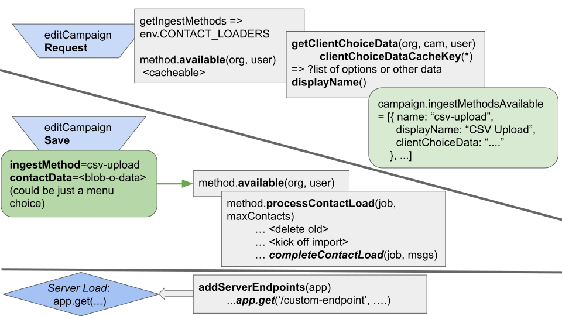

# Contact Loaders Ingest Framework

One of the core tasks in a Spoke campaign is loading in the contacts for texters to target.

One default and standard way to do so is upload a CSV with their
names, cells, zips, and custom fields. So CSV uploading (`csv-upload`) is
one of many possible (existing or not yet) ways to load contacts for a campaign.

There's a framework in Spoke that allows the System Administrator to enable additional
ways to load contacts in, as well as make it straightforward to for developers to
integrate into CRMs (Constituent Relationship Management systems) or other software/databases.

## Enabling other contact loaders

Contact Loaders available to organizations in the system are managed by the
environment variable `CONTACT_LOADERS`. Unset, the default includes `csv-upload` and
`datawarehouse`. The value should be the list of enabled contact loaders separated by `,` (commas)
without any spaces before or after the comma. E.g. One to enable testing would be `test-fakedata,csv-upload`

Just enabling a contact loader is the first step, but contact loaders often
have additional context required for them to be visible (e.g. for datawarehouse, many `WAREHOUSE_DB_*`
environment variables need to be present (along with the user being a super-admin).

The server admin can look at the ingest loader index.js file in the appropriate directory TKTK
inside the function `serverAdministratorInstructions`
(this data might sometime be visible to superadmins on a documentation page)

For testing and development, there is also a `test-fakedata` contact loader that makes it easy to
add fake contacts -- it will only be visible if the site or organization are set to use
DEFAULT_SERVICE=fakeservice

## Developing Contact Loaders

The best way to make a new contact loader is something like this in the codebase:

```
cd src/integrations/contact-loaders
cp -rp test-fakedata <NEW_CONTACT_LOADER_NAME>
```

Then edit the two files (index.js and react-component.js) in that directory.

Contact loaders implement common functions that are called and used in different parts of the application.

There are three main "points" where a contact loader can hook into the application.

1. When a campaigner loads the "edit Campaign" screen, a contact loader provides information to display to
   help the campaigner load the contacts. This can be nothing when it's e.g. provided entirely from the
   campaigner (e.g. in csv upload), however if there is e.g. a backend system to query which lists/items
   are available.
2. When a campaigner submits the contact-loader specific information to save the campaign -- here
   Spoke will pass the data to a processContactLoad method for the ingest method chosen.
3. For sophisticated applications, the ingest method can add endpoints or otherwise change the
   express app on-load of the function. This can allow asynchoronous server-to-server APIs if necessary.

These three are represented in this graphic to outline the workflow:



### What to implement

The first, `index.js` is the backend -- You'll need to change the exported `name` value
and then implement each of the functions included. Some of them may not be relevant to you,
in which case you can return nothing or leave them alone.

Here are the methods you'll definitely need to implement:

- `displayName()` -- what will campaign admins see to choose this option for contact loading
- `available(organization, user)` -- is your contact loader to this user and organization
- `processContactLoad(job, maxContacts)` -- the final processing of data based on the data you send back from the react-component to load the contacts. Be mindful of the requirements documented in the function.
- Please refer to the same contact loaders for the other methods that will be useful to implement.

Then you'll want to implement `react-component.js`. This file is passed whatever you sent back with
`getClientChoiceData()` in the backend, along with some context for the component. It will be loaded
when the campaign admin chooses your ingest method (set it first in the list of CONTACT_LOADERS env
var to be listed first).
