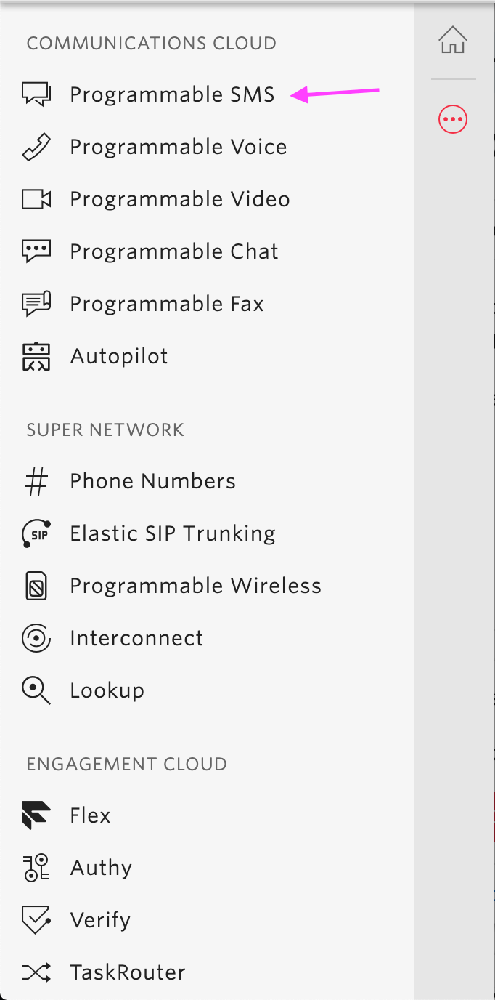
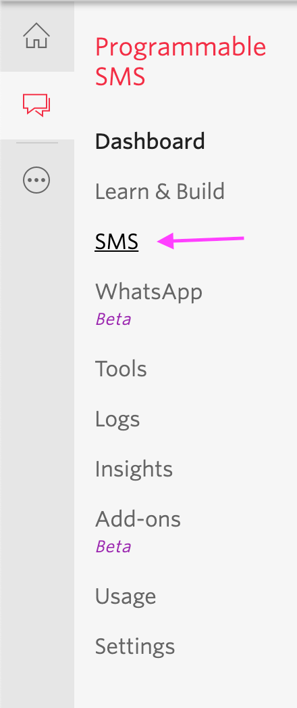
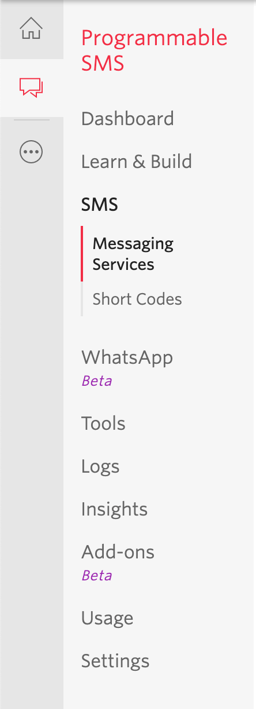
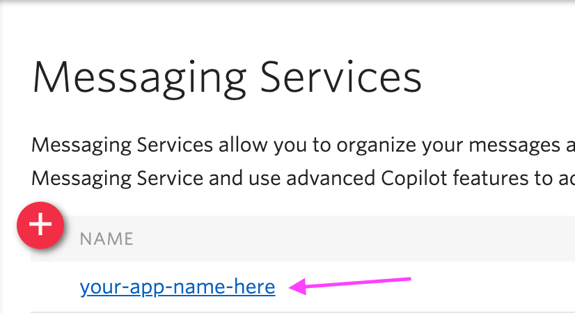
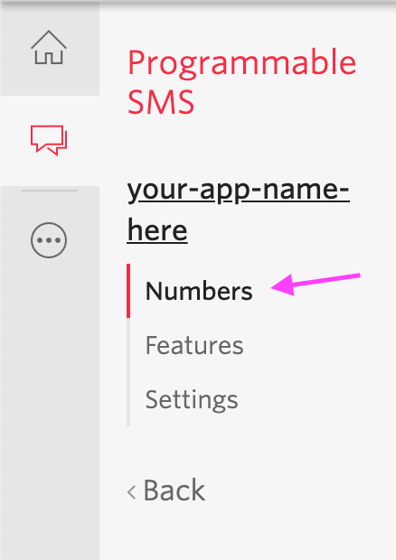
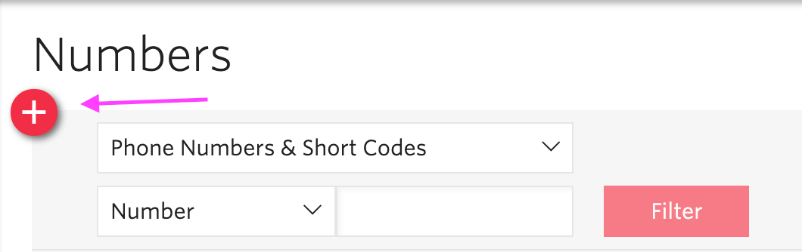
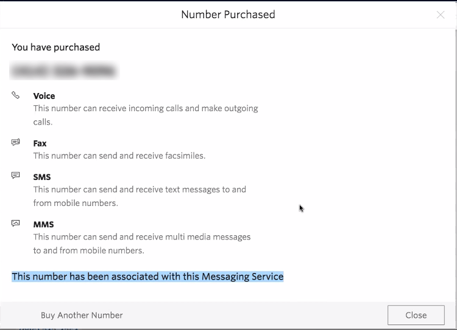

### How to Buy Numbers for message services in Spoke

# How to Set Up Per-Org Number Buying (with Twilio)

1. Set the following config variables / env variables in Heroku or AWS
`TWILIO_MULTI_ORG=1`
`EXPERIMENTAL_PHONE_INVENTORY=1`

2. Create messaging service in Twilio with org name https://www.twilio.com/console/sms/services 
3. Go to main console https://www.twilio.com/console and copy Account SID and Auth Token for your “project” in Twilio, and add those values to Twilio Credentials section of the Settings tab for the corresponding organization. 
4. Go to Messaging Service in Twilio and navigate to the new message service you created, copy the SID next to the service name in the table. Add this value to the “Account SID” in the Settings tab in Spoke. Click Save Twilio Credentials, and select OK again. 
5. Copy the inbound request URL that pops up when you create a Twilio Credential in Spoke. The link looks like this: https://spoke.nycet.org/twilio/## 
6. Click into your new messaging service in Twilio, navigate to Integrations in the side panel. In incoming messages, select Send a Webhook. Paste the inbound request URL into the Request URL and the Fallback URL values in Twilio. 
7. Paste [your spoke url]/twilio-message-report in the Callback URL in twilio. Click SAVE in twilio. 
8. Go to the Phone Numbers section in Spoke, and purchase at least one phone number. Select “add to this organization’s messaging service”

# How to Set Up Per-Campaign Number Buying (with Twilio)
1. Make sure you have the following config variables / env variables
`TWILIO_MULTI_ORG=1`
`EXPERIMENTAL_PHONE_INVENTORY=1`
2. Add the following variables either to config / env variables (if you are doing per-campaign set up for all your orgs) or to the “features” json {} in the organization table in your SQL database (if you are setting up per-campaign phone number buying for only some of the orgs in your system)
`EXPERIMENTAL_CAMPAIGN_PHONE_NUMBERS=1`
`EXPERIMENTAL_TWILIO_PER_CAMPAIGN_MESSAGING_SERVICE=1` 
3. In the Phone Numbers section in Spoke, purchase phone numbers; then after you create any new campaign in Spoke, you can assign phone numbers to that campaign.

### How to Buy Numbers Directly in Twilio

This guide assumes you already have twilio set up with Spoke. If you don't, check out our guide on [integrating Twilio](HOWTO_INTEGRATE_TWILIO.md).

If you are comfortable using the Linux command line, and/or will be buying many numbers across many area codes, you should take a look at the [switchboard-twilio tool](https://github.com/StateVoicesNational/switchboard-twilio) which is here to help you buy in higher quantities.

1. Go to the “Programmable SMS Dashboard” in Twilio
   
2. Select "SMS"
   
3. Select "Messaging Services"
   
4. Click the app on this screen that's corresponding to whatever you chose when you created the [Spoke messaging service in step 5 here](HOWTO_INTEGRATE_TWILIO.md) - You should see a sub menu with "numbers", "features", "settings"
   
5. Click numbers
   
6. Click the red plus circle or "buy a number" -- they do the same thing, so whichever one you see you can click
   
7. Search by area code to find numbers
8. Click the buy button when you're ready to buy the number. - You should see: "The number has been associated with this messaging service" in the modal when you buy a number. That is the indicator that the number is being linked to Spoke.
   
