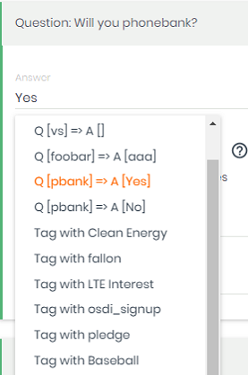
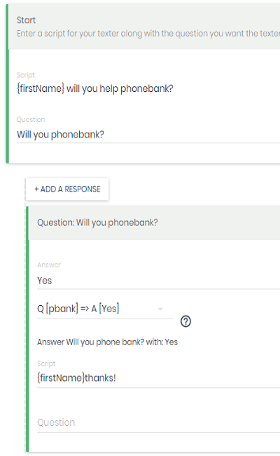

OSDI Support
-------

### Outbound Client
Outbound Client: Spoke has an outbound client with action handler style behavior to push data into another system like VAN/EveryAction, Action Network or others

#### Quickstart

Outbound OSDI is configured with these environment variables
* `OSDI_OUTBOUND_API_TOKEN` Your OSDI API TOKEN
* `OSDI_OUTBOUND_AEP` [Optional] The URL of your OSDI API Entry Point. (Defaults to VAN/EveryAction)

Once these are set, in the campaign interaction step / script form, you should see actions for survey questions, tags, activist codes in the remote system

> Test your configuration by running `yarn osdi-info actions` which will show you Spoke's view of the available actions on your OSDI server  

[More information on OSDI Outbound Client](#outbound-osdi-actions)

### OSDI Server

#### Quickstart

Set environment variable `OSDI_SERVER_ENABLE` to `true`

Once set, you should see a new section under __Settings__ in the admin menu to turn on OSDI Server service for the organization, set your API Token, and visit the HAL Browser to begin your quest for enlightenment.


[More information on OSDI Server](#osdi-server)

### Appendix

------
 
# Outbound OSDI Actions

### Configuration
Outbound OSDI is configured with these environment variables
* __OSDI_OUTBOUND_API_TOKEN__ Your OSDI API TOKEN
* __OSDI_OUTBOUND_AEP__ [Optional] The URL of your OSDI API Entry Point

> Note that VAN/EveryAction API Tokens require the database mode (1=My Campaign, 0=My Voters) appended following a pipe '|'.  eg: MYAPICODE|1
>
By default, if you configured an API TOKEN but no AEP, Spoke will push to VAN / EveryAction using `https://osdi.ngpvan.com/api/v1`

### Usage
Once configured, when you are editing your interaction steps, Spoke will download the available survey questions and tags (aka Activist Codes in VAN) 

In the drop down for actions, you'll see options to apply tags/activist codes or submit responses to survey questions, as well as a simple OSDI Person Signup Helper

#### Dropdown of Choices


#### Choice Chosen


### Matching Logic
By default, when pushing via OSDI, Spoke will invoke the `osdi:person_signup_helper` endpoint on the OSDI server to match or create a corresponding OSDI person.  It will do based on fields in spoke for mobile phone number, zip, name etc.

Once matched, Spoke will invoke `osdi:record_canvass_helper` to apply tags/activist codes and submit responses to survey questions. 

Spoke will also save the remote OSDI Identifier in a contact custom field named `osdi_identifier` to avoid matching on subsequent actions for teh same contact.

To improve matching, when you import into spoke, include `email` as a custom field.  

If you are importing contacts that you got from the OSDI system itself (eg VAN), include the OSDI Identifier itself (eg VANID) in a custom field named `osdi_identifier`

If `osdi_identifier` is present, then Spoke will skip the `osdi:person_signup_helper` and just to the `osdi:record_canvass_helper`
 
### Diagnostics and Troubleshooting

__NOTE Regarding Edge Case__ 
> In the case that you setup Spoke talking to one OSDI server, and then reconfigure it to talk to another, by changing the environment variables, you'll need to perform a cleanup step.  Your existing interaction step actions will still be in the database.  So will any external IDs received from the remote server for optimization.  This will lead spoke to use the previously set IDs and actions with the new server.  To clean this, run:

`yarn osdi-info wipe`


#### CLI Tool
A diagnostics tool is included and can be run with the following command

`yarn osdi-info`

The default output will display the OSDI AEP spoke is configured to talk to, and the survey questions, activist codes etc it was about to discover, and demonstrate your API is correct.

`yarn osdi-info aep`

Displays the actual AEP data, eg attributes, links, collections available

'yarn-osdi-info questions|tags'

Displays just the actions of the specified type like questions or tags/activist codes.

#### Environment Variables

`OSDI_LOGGING_ENABLED`
When set to true, the OSDI components will emit log messages with OSDI JSON traces of what's going back and forth between systems.

`OSDI_OUTBOUND_DISABLE_CACHE`

To avoid taxing the UI when editing interaction steps, the downloaded actions are cached in redis.  When troubleshooting, or if updating survey question in VAN, this can be annoying.

The environment  variable `OSDI_OUTBOUND_DISABLE_CACHE=true` can be used to prevent this caching.

#### HAL Browser

Most OSDI systems host, or can work with the HAL Browser.  For example, the following links will take you to them:
* [https://osdi.ngpvan.com/](https://osdi.ngpvan.com/)
* [https://actionnetwork.org/api/browser/](https://actionnetwork.org/api/browser/)

#### OSDI Sandbox Tutorial
If you don't yet have a production account with your other system yet, but want to get a feel for working with OSDI.  You can set up a sandbox with sample data for yourself, and follow a tutorial.

[Tutorial: Zero to Person Signup Helper](http://opensupporter.org/osdi-101-zero-to-person-signup-helper/)
[OSDI Sandbox](http://demo.osdi.io)

# OSDI Server

Spoke supports People Import, exposes contacts as OSDI People, interaction steps and questions answers as OSDI Questions and Answers.

It also exposes Messages, Assignments and Users in an experimental schema.

One can now write automation scripts without having to be familiar with Node, directly add code to Spoke, or put extra work on the Spoke developers.  Taking python, ruby or other scripting class, or self-learning is sufficient.

### HOWTO

#### Configuration

Set environment variable `OSDI_SERVER_ENABLE` to `true`
If you need the server to use a response content-type other than `application/json` such as `application/hal+json`, set the `OSDI_SERVER_CONTENT_TYPE` variable accordingly.

Browse to http://spoke.dev.joshco.org/osdi

While looking at the HAL browser, try the following walkthrough

1. Click the link for the organization you want to browse
2. See the list of campaigns
3. Choose the campaign you want to browse
4. You should now be at the API Entry Point for the Campaign
5. Click the link for 'osdi:people' and see the first page of people results
6. Choose a person, and look at it's links.  You can navigate to that person's Answers (question responses), or messages
7. Go back to the AEP. (or Click "Go To Entry Point" in the top navbar to start over)
8. Click the link for 'osdi:answers' and see the recently added answers.  From each answer you can navigate to the person (campaign contact) or the question itself (derived from interaction steps)

> You can also start navigating users -> assignments -> messages

### Supported Scenarios

* Batch and Single Import of people / contacts
* Browsing the collection of people
* Downloading the target’s responses and import them into another system of the customer’s choice, eg VAN Survey Questions or others.
* Downloading the messages sent back and forth
* A simple way to browse the underlying data in Spoke without writing database SQL
 

### Service Implementation

* Person Signup / People Import Allows batched import via OSDI of contacts
* People Collection
* Questions
* Answers
* Messages
* Spoke Assignments
* Example Client Script

In the dev-tools/osdi-client directory, there is an osdi-client.py script.

There are also two CSVs sample.csv and small.csv with some fake data to use with the script.

Example Syntax

```
./osdi-client.py -u http://your-spoke-server/osdi/org/1/campaigns/5/api/v1 -k APIKEY -f ./small.csv                                            
```
