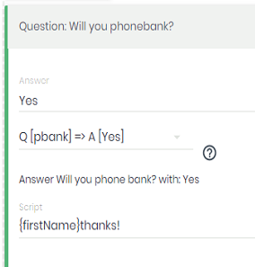

# OSDI Support

Server: Spoke supports OSDI with a server to expose its own data.
 
Outbound Client: Spoke has an outbound client with action handler style behavior to push data into another system

## Outbound OSDI Actions

### Configuration
Outbound OSDI is configured with these environment variables
* __OSDI_OUTBOUND_API_KEY__ Your OSDI API TOKEN
* __OSDI_OUTBOUND_AEP__ [Optional] The URL of your OSDI API Entry Point

By default, if you configured an API TOKEN but no AEP, Spoke will push to VAN / EveryAction using `https://osdi.ngpvan.com/api/v1`

### Usage
Once configured, when you are editing your interaction steps, Spoke will download the available survey questions and tags (aka Activist Codes in VAN)

In the drop down for actions, you'll see options to apply tags/activist codes or submit responses to survey questions.

#### Dropdown of Choices


#### Choice Chosen


### Matching Logic
By default, when pushing via OSDI, Spoke will invoke the `osdi:person_signup_helper` endpoint on the OSDI server to match or create a corresponding OSDI person.  It will do based on fields in spoke for mobile phone number, zip, name etc.

Once matched, Spoke will invoke `osdi:record_canvass_helper` to apply tags/activist codes and submit responses to survey questions. 

Spoke will also save the remote OSDI Identifier in a contact custom field named `osdi_identifier` to avoid matching on subsequent actions for teh same contact.

To improve matching, when you import into spoke, include `email` as a custom field.  

If you are importing contacts that you got from the OSDI system itself (eg VAN), include the OSDI Identifier itself (eg VANID) in a custom field named `osdi_identifier`

If `osdi_identifier` is present, then Spoke will skip the `osdi:person_signup_helper` and just to the `osdi:record_canvass_helper`
 


## OSDI Server

Spoke supports People Import, exposes contacts as OSDI People, interaction steps and questions answers as OSDI Questions and Answers.

It also exposes Messages, Assignments and Users in an experimental schema.

One can now write automation scripts without having to be familiar with Node, directly add code to Spoke, or put extra work on the Spoke developers.  Taking python, ruby or other scripting class, or self-learning is sufficient.

### HOWTO

Browse to http://spoke.dev.joshco.org/osdi

While looking at the HAL browser, try the following walkthrough

1. Click the link for the organization you want to browse
2. See the list of campaigns
3. Choose the campaign you want to browse
4. You should now be at the API Entry Point for the Campaign
5. Click the link for 'osdi:people' and see the first page of people results
6. Choose a person, and look at it's links.  You can navigate to that person's Answers (question responses), or messages
7. Go back to the AEP. (or Click "Go To Entry Point" in the top navbar to start over)
8. Click the link for 'osdi:answers' and see the recently added answers.  From each answer you can navigate to the person (campaign contact) or the question itself (derived from interaction steps)

> You can also start navigating users -> assignments -> messages

### Supported Scenarios

* Batch and Single Import of people / contacts
* Browsing the collection of people
* Downloading the target’s responses and import them into another system of the customer’s choice, eg VAN Survey Questions or others.
* Downloading the messages sent back and forth
* A simple way to browse the underlying data in Spoke without writing database SQL
 

### Service Implementation

* Person Signup / People Import Allows batched import via OSDI of contacts
* People Collection
* Questions
* Answers
* Messages
* Spoke Assignments
* Example Client Script

In the dev-tools/osdi-client directory, there is an osdi-client.py script.

There are also two CSVs sample.csv and small.csv with some fake data to use with the script.

Example Syntax

```
./osdi-client.py -u http://your-spoke-server/osdi/org/1/campaigns/5/api/v1 -k APIKEY -f ./small.csv                                            
```
