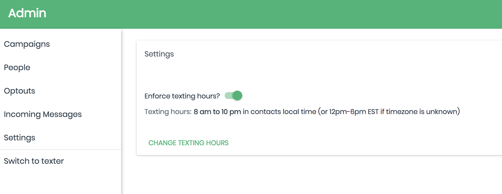

# Texting Hours Enforcement

Spoke can be configured to prevent volunteers from sending texts earlier or later than configurable start and end times. 

Texting hours configuration applies at the **organization** level. All of the organization's campaigns have the same configuration.

## Configuring Spoke 

Spoke will present the following page during organization creation.  It is also accessible from the Settings link on the left menu when logged in as an Admin.

Toggle "Enforce texting hours?" to turn enforcement on and off.  Click "Change Texting Hours" to adjust the start and end times.

This configuration is stored in the `organization` table in the database.

Spoke will not send texts to contacts before the start time or after the end time.

If the end time is set to *before* the start time, texting hours will end *the next day* at that time. For example: if the texting hours are set from 8pm to 2am, 1am will be a valid texting hour.

**How the current time is determined for a particular contact depends on other aspects of Spoke's configuration.**

## TZ environment variable

If the `TZ` environment variable is set, Spoke will assume that all contacts are located in the time zone specified by the variable.  The current time in that time zone -- with Daylight Savings applied if it is summer in that area and the time zone has Daylight Savings Time -- is considered the current time for purposes of deciding whether it is OK to send texts.

The timezone in New York City is specified by the string `America/New_York`. Other time zone names are listed [here.](https://en.wikipedia.org/wiki/List_of_tz_database_time_zones)

## Contact ZIP code

If the `TZ` environment variable is not set, Spoke will infer a time zone for each contact from the contact's ZIP code.

If a contact does not have a ZIP code, Spoke will assume the contact is in New York City and use the local time there to determine if it's OK to send texts.

## Is it Daylight Savings Time?

If spoke is using ZIP codes to infer a contact's time zone, by default it will assume Daylight Savings Time is in effect in that time zone if Daylight Savings Time is in effect in New York City.  To use a different location to determine whether Daylight Savings Time is, or is not, in effect, change the environment variable `DST_REFERENCE_TIMEZONE`. 

Note: The default configuration is suitable for all locations in the United States that use Daylight Savings Time.  `DST_REFERENCE_TIMEZONE` may need to change if a Spoke deployment is being used outside the United States because other countries may change their clocks on different schedules. Daylight Savings Time is in effect during the summer, so it is especially important to change `DST_REFERENCE_TIMEZONE` if a Spoke deployment is being used in the southern hemisphere.
